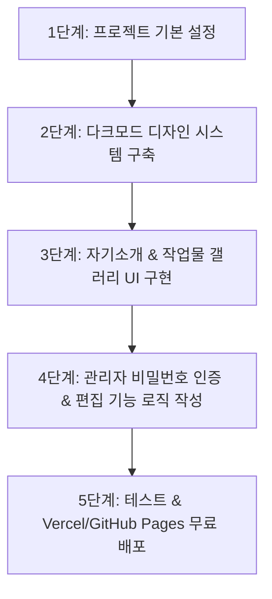

# [PRD] 남진혁 강사의 AI 포트폴리오 웹사이트 (AI Work Showcase)

---

## 1. 문서 개요 (Overview)

| 항목 | 내용 |
| :--- | :--- |
| **프로젝트명** | AI 웹/앱 포트폴리오 사이트 (Nam Jin-hyuk AI Portfolio) |
| **기획자 / 작성자** | 남진혁 |
| **타겟 사용자** | IT / AI 교육 수강생 (성인) |
| **주요 목적** | AI로 직접 제작한 웹/앱 결과물을 체계적으로 시각화하고, 학생들에게 직관적인 시연 및 가이드를 제공하기 위함 |
| **문서 상태** | 확정 (v1.0) |
| **저장 경로** | `portfolio/prd.md` |

---

## 2. 프로젝트 배경 및 목적 (Background & Objectives)

### 2.1 배경
* 강사(남진혁)는 다양한 AI 툴(ChatGPT, Claude, Midjourney, v0, Bolt 등)을 활용하여 빠르게 웹사이트 및 애플리케이션을 제작하고 있음.
* 교육을 받는 성인 수강생들에게 "AI를 활용해 완성된 실질적 결과물"을 시각적으로 보여주고 체험하게 함으로써 교육적 동기부여와 실무 적용 사례를 제시할 플랫폼이 필요함.

### 2.2 핵심 목적
1. **결과물 아카이빙**: AI로 제작한 웹/앱 프로젝트를 카드 형태로 한눈에 보여줌.
2. **신뢰감 형성**: 수강생들에게 강사의 역량과 실제 AI 활용 사례를 입증.
3. **손쉬운 자체 관리**: 별도의 복잡한 백엔드 서버 없이도 강사 본인이 실시간으로 자기소개와 작업물을 추가/수정 가능하도록 구현.

---

## 3. 타겟 페르소나 (Target Personas)

### 👤 페르소나 A: 성인 수강생 (Primary User)
* **특징**: AI 활용법 및 웹/앱 제작을 배우기 위해 남진혁 강사의 강의를 듣는 수강생.
* **니즈**:
  * 강사님이 AI로 어떤 실제 서비스까지 만들어봤는지 궁금함.
  * 프로젝트별로 사용된 AI 도구와 바로가기 링크를 확인하고 직접 테스트해보고 싶음.
  * PC와 스마트폰 어느 기기에서든 빠르게 접속하여 확인할 수 있길 원함.

### 👤 페르소나 B: 강사 남진혁 (Admin User)
* **특징**: 사이트 소유자이자 관리자.
* **니즈**:
  * 비밀번호 입력만으로 즉시 자기소개나 작업물을 수정/업데이트하고 싶음.
  * 신규 작업물이 생길 때마다 대표 이미지, 설명, 사용 AI 도구, 웹 링크를 쉽게 등록하고 싶음.

---

## 4. 디자인 컨셉 및 UX 시스템 (Design & UX Guidelines)

 초보자도 한눈에 압도적인 완성도를 느낄 수 있는 **미래지향적 테크니컬 다크 스타일**로 디자인합니다.

```
+-----------------------------------------------------------------------+
|  [Header] Logo (남진혁 AI Portfolio)             [🔒 Admin Login]     |
+-----------------------------------------------------------------------+
|                                                                       |
|  [Hero / Bio Section] (Glassmorphism Card)                            |
|  - 프로필 사진 / 이름: 남진혁                                             |
|  - 관심 분야 & 핵심 역량                                                |
|  - 자기소개 텍스트 (관리자 로그인 시 ✏️ 편집 버튼 활성화)                      |
|                                                                       |
+-----------------------------------------------------------------------+
|                                                                       |
|  [AI Works Showcase]                                                  |
|  - [전체] [웹 서비스] [앱 / 유틸리티] (필터 탭)                          |
|                                                                       |
|  +-------------------+  +-------------------+  +-------------------+  |
|  | [Project Card 1]  |  | [Project Card 2]  |  | [Project Card 3]  |  |
|  | - 썸네일 이미지    |  | - 썸네일 이미지    |  | - 썸네일 이미지    |  |
|  | - 프로젝트 제목   |  | - 프로젝트 제목   |  | - 프로젝트 제목   |  |
|  | - 사용 AI 태그     |  | - 사용 AI 태그     |  | - 사용 AI 태그     |  |
|  | - 바로가기 버튼   |  | - 바로가기 버튼   |  | - 바로가기 버튼   |  |
|  +-------------------+  +-------------------+  +-------------------+  |
|                                                                       |
+-----------------------------------------------------------------------+
|  [Footer] Contact Info & Copyright                                    |
+-----------------------------------------------------------------------+
```

### 4.1 디자인 주요 특징
1. **다크 모드 & 테크니컬 (Futuristic Dark Theme)**
   * **배경색**: 딥 숯색/블랙계열 (`#0B0F19`, `#111827`)
   * **포인트 컬러**: 네온 사이언/블루 (`#00F2FE`, `#4FACFE`), 네온 바이올렛 (`#7F00FF`)
2. **글래스모피즘 (Glassmorphism)**
   * 카드의 배경에 반투명 유리 느낌의 `backdrop-filter: blur(16px)`과 미세한 경계선 선(Border Gradient)을 적용해 트렌디한 느낌 연출.
3. **마이크로 인터랙션 (Micro-animations)**
   * 프로젝트 카드 호버 시 살짝 떠오르는 부드러운 3D 트랜지션 및 은은한 글로우(Glow) 효과.

---

## 5. 상세 기능 명세 (Feature Specifications)

### F-1. 비밀번호 기반 간편 관리자 모드 (Admin Mode)
* **목적**: 외부 사용자(수강생)의 무단 수정을 막고, 강사 본인만 간편하게 수정 권한을 얻음.
* **동작 흐름**:
  1. 우측 상단 `🔒 관리자 로그인` 버튼 클릭.
  2. 비밀번호 입력 모달 팝업 등장.
  3. 지정된 비밀번호 일치 시 **"관리자 모드 활성화"** (상단에 🟢 Admin Active 표시).
  4. 자기소개 영역과 작업물 카드에 `✏️ 수정`, `➕ 작업물 추가`, `🗑️ 삭제` 버튼이 즉시 노출됨.
  5. 수정 완료 후 `💾 저장` 버튼을 누르면 LocalStorage 또는 백엔드 데이터베이스에 즉시 업데이트 반영.

---

### F-2. 나만 편집 가능한 자기소개 섹션 (Self-Introduction Section)

* **구성 요소**:
  1. **프로필 기본 정보**:
     * 이름: 남진혁
     * 역할: AI 웹/앱 크리에이터 & IT 강사
     * 주요 분야 태그: `AI Web App Development`, `Prompt Engineering`, `No-Code & AI Tools`
  2. **자기소개 본문**:
     * 교육 철학, AI로 작업물을 만드는 목적, 수강생들에게 전하는 메시지 작성.
  3. **편집 기능 (Admin Only)**:
     * 관리자 인증 상태일 때 자기소개 카드 상단에 `✏️ 편집` 버튼 생성.
     * 클릭 시 텍스트 박스로 전환되어 내용을 수정하고 `저장` 가능.

---

### F-3. AI 작업물 갤러리 페이지 (AI Works Showcase)

* **구성 요소**:
  1. **카테고리 필터**:
     * `전체`, `웹 서비스`, `모바일/앱`, `AI 유틸리티` 탭으로 분류 탐색 가능.
  2. **작업물 카드 (Project Card) 정보**:
     * **대표 이미지/썸네일**: AI 앱 실행 스크린샷 또는 이미지.
     * **프로젝트 제목**: 예) "AI 운세 쿠키 생성기", "스마트 튜터 웹앱"
     * **한 줄 설명**: 앱의 주요 기능 및 특징 간략 소개.
     * **사용 AI 도구 태그**: 예) `ChatGPT-4o`, `Claude 3.5 Sonnet`, `Midjourney`, `v0.dev`
     * **바로가기 링크**: 실제 서비스 데모 사이트나 GitHub 주소로 연결되는 외부 링크 버튼.
  3. **작업물 관리 기능 (Admin Only)**:
     * `➕ 새 작업물 등록` 버튼 클릭 시 폼(Form) 모달 열림:
       * 제목, 설명, 썸네일 URL, 바로가기 URL, 사용 AI 도구 입력.
     * 각 카드마다 `수정` 및 `삭제` 버튼 제공.

---

### F-4. 반응형 레이아웃 및 접근성 (Responsive & Accessibility)
* **데스크톱 (1200px+)**: 3열 그리드 레이아웃.
* **태블릿 (768px ~ 1199px)**: 2열 그리드 레이아웃.
* **모바일 (~767px)**: 1열 직관적인 카드 레이아웃, 터치하기 편한 대형 버튼 크기(최소 44px) 제공.

---

## 6. 정보 구조도 (Information Architecture - IA)

```text
[Main Portfolio Site]
 ├── 1. Header Navigation
 │    ├── 로고 (남진혁 AI Portfolio)
 │    ├── 내비게이션 메뉴 (자기소개 / 작업물 / 연락처)
 │    └── 🔒 관리자 로그인 (모달 실행)
 ├── 2. Hero & Bio Section
 │    ├── 프로필 이미지 & 이름 (남진혁)
 │    ├── 핵심 관심 분야 / 역량 태그
 │    └── 자기소개글 (✏️ 편집 기능 - Admin)
 ├── 3. AI Works Showcase Section
 │    ├── 카테고리 필터 (전체 / 웹 / 앱 / 유틸리티)
 │    ├── ➕ 새 작업물 추가 버튼 (Admin Only)
 │    └── 프로젝트 카드 목록
 │         ├── 썸네일
 │         ├── 제목 & 설명
 │         ├── 사용 AI 도구 (ChatGPT, Claude 등)
 │         └── 바로가기 (Live Demo) 버튼
 └── 4. Footer Section
      ├── 수강생을 위한 안내문
      └── 이메일 / SNS / 수업 안내 링크
```

---

## 7. 추천 기술 스택 (Recommended Tech Stack)

| 구분 | 추천 기술 | 선정 이유 |
| :--- | :--- | :--- |
| **Front-end** | HTML5, CSS3, Modern Vanilla JavaScript (ES6+) | 초보자도 구조를 직관적으로 이해하고 수정할 수 있으며, 빌드 과정 없이 빠르게 동작 |
| **Design / Styling** | Vanilla CSS (Flexbox/Grid), Glassmorphism Style | 추가 라이브러리 없이 가볍고 네온 다크모드 Visual WOW 효과 극대화 |
| **Fonts** | Pretentard / Inter (Google Fonts) | 가독성이 뛰어나고 깔끔한 모던 폰트 |
| **Data Storage** | Browser `localStorage` (또는 Supabase/Firebase 확장) | 백엔드 서버 구축 없이도 브라우저 내에서 즉시 관리자 편집 데이터 저장 가능 |
| **Hosting** | Vercel / GitHub Pages | 무료이며 AI로 만든 정적 웹사이트를 1분 만에 글로벌 배포 가능 |

---

## 8. 단계별 개발 로드맵 (Development Roadmap)



1. **1단계: HTML 구조잡기 (`index.html`)**
   * 헤더, 자기소개, 작업물 갤러리 섹션, 푸터 태그 구성.
2. **2단계: CSS 스타일링 (`style.css`)**
   * 다크모드 컬러 변수 지정, 글래스모피즘 카드 스타일 및 네온 포인트 컬러 적용.
3. **3단계: 관리자 인증 & 편집 로직 (`app.js`)**
   * 비밀번호 검증 함수 구현.
   * `localStorage`를 활용한 자기소개 및 작업물 목록 CRUD(Create, Read, Update, Delete) 기능 연동.
4. **4단계: 모바일 반응형 검증**
   * 미디어 쿼리를 이용해 모바일/태블릿 기기 테스트.
5. **5단계: 웹 배포**
   * Vercel 또는 GitHub Pages를 이용해 수강생들에게 공유 가능한 릴리즈 URL 생성.

---

## 9. 초보자를 위한 용어 설명 (Glossary for Beginners)

* **PRD (Product Requirement Document)**: 제품 요구사항 정의서. 만들고자 하는 웹/앱이 무엇인지, 어떤 기능과 디자인이 필요한지 정리한 문서입니다.
* **Glassmorphism (글래스모피즘)**: 흐릿한 반투명 유리판 느낌을 주는 최신 UI 디자인 스타일입니다.
* **Admin Mode (관리자 모드)**: 일반 방문자는 볼 수만 있고, 작성자만 내용을 수정할 수 있도록 제한하는 기능입니다.
* **LocalStorage (로컬스토리지)**: 웹 브라우저 안에 데이터를 저장해두는 공간으로, 별도 DB 서버 없이도 내가 수정한 자기소개나 작업물이 사라지지 않고 유지됩니다.
* **Responsive Web (반응형 웹)**: 컴퓨터, 태블릿, 스마트폰 화면 크기에 맞춰 레이아웃이 자동으로 변하는 웹사이트입니다.

---

> **기획자 노트**: 본 PRD는 남진혁 강사님의 요구사항과 수강생 대상 교육용 포트폴리오 목적에 최적화하여 작성되었습니다. 작성된 `portfolio/prd.md` 파일을 기반으로 프론트엔드 개발을 즉시 시작할 수 있습니다.
